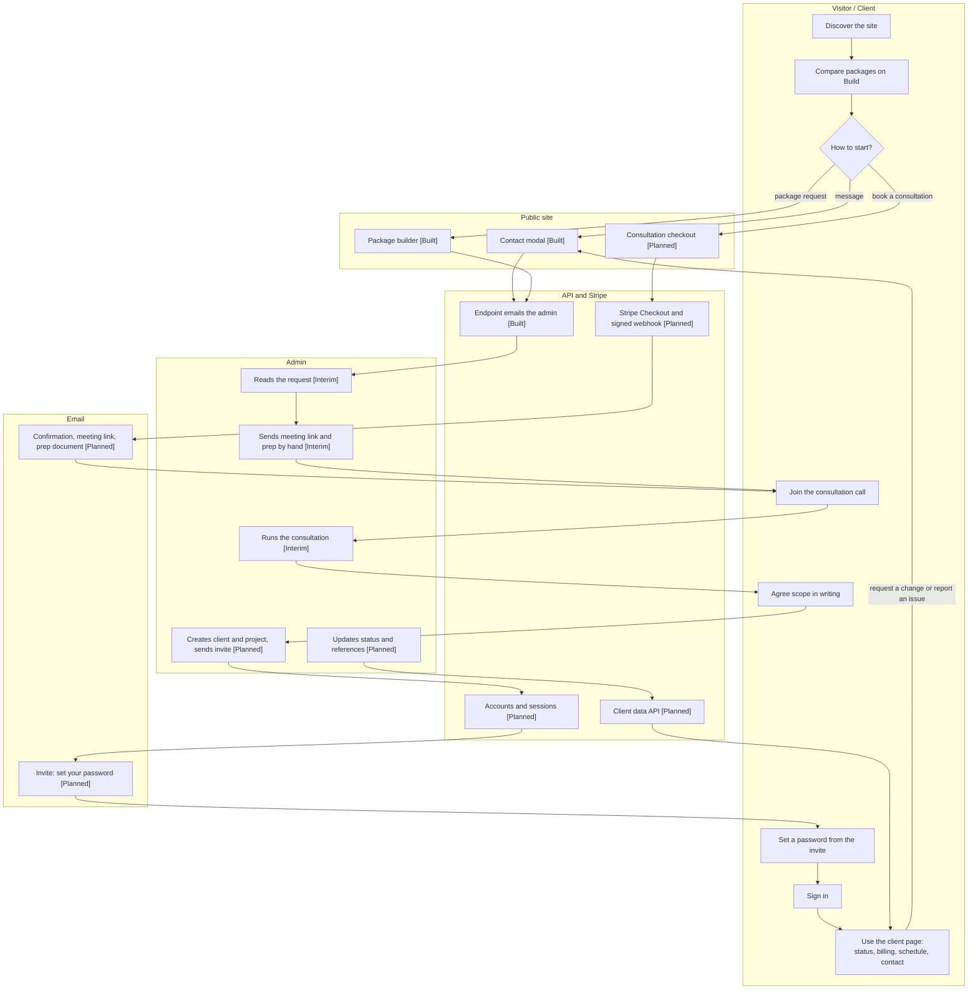
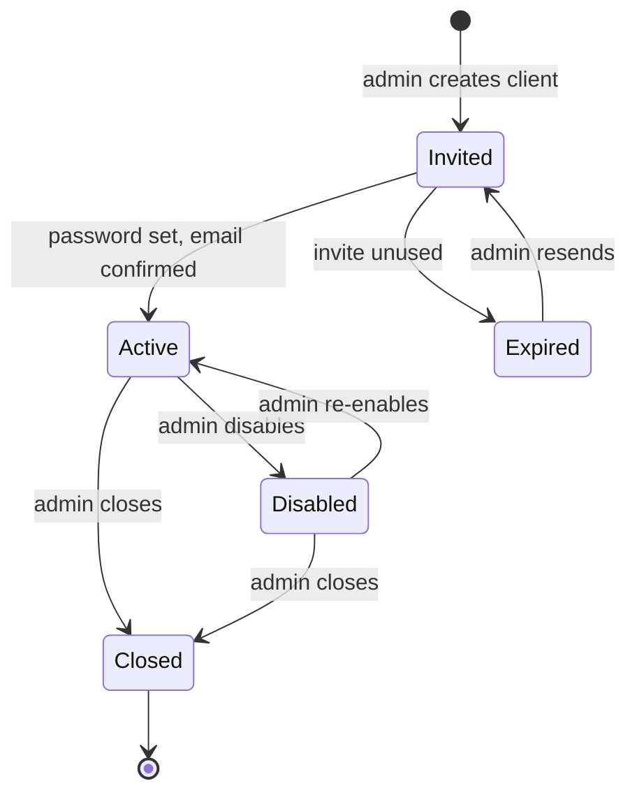
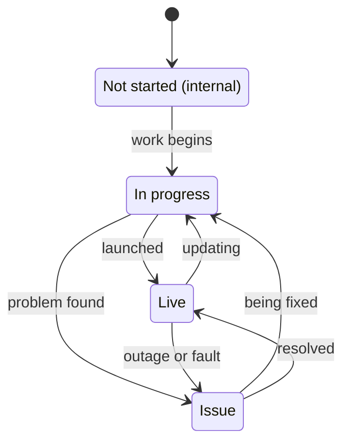
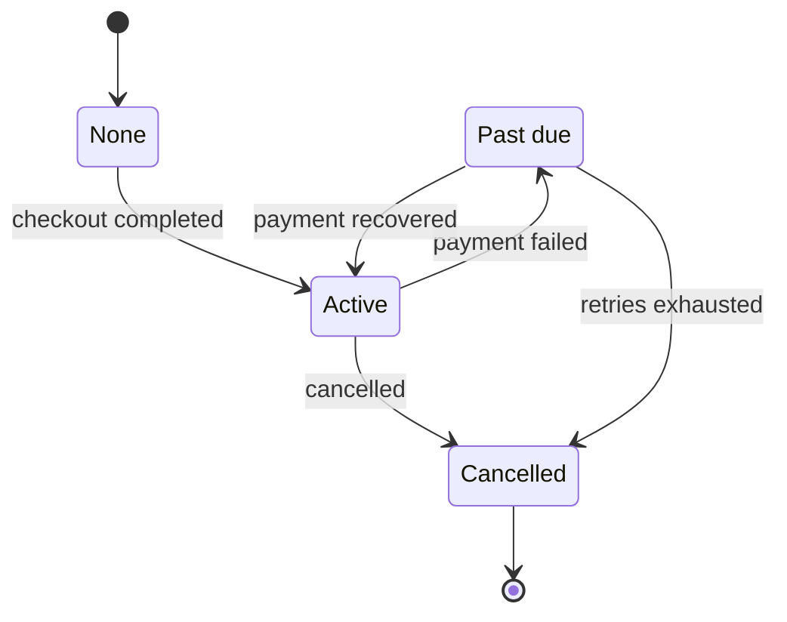

# Doxxus MVP Outline

**Status:** Draft for implementation planning  
**Product:** Doxxus, a solo developer studio and client services portal  
**Primary domain:** https://doxxus.us/  
**Last reviewed:** 2026-10-06

## Objective

Evolve Doxxus from a creative portfolio into a sleek, low-friction sales and client-services system for small local businesses, new ventures, creators, and passion projects.

The site should make three things obvious:

1. What B McCool builds.
2. What a prospective client can buy.
3. How a client can track an active project after purchase.

The positioning is a technical liaison and launch manager: one person accountable from initial idea through design, build, integration, launch, and follow-up.

## Product Principles

- Keep the current dark, experimental DOXXUS identity, globe motif, motion, glass surfaces, and restrained rainbow accents.
- Keep the interface minimal and card-driven, using the Fitndex-style pill treatment for pricing add-ons.
- Show proof before making claims. Rabbit Habit is the flagship visual case study because its simple interface complements the existing Doxxus theme.
- Store only contact and project data required to operate the service.
- Use hosted payment pages and established authentication primitives. Never store card data or plaintext passwords.
- Keep the public website useful without requiring an account.
- Add operational complexity only when it supports a real client workflow or sale.

## Audience and Positioning

**Audience:** Small-time, new, local, and passion-project clients who need a reliable person to guide a website or application from idea to launch.

**Role:** Product guide, designer, developer, integration lead, and launch manager.

**Working message:**

> Clear scope. Thoughtful software. One person accountable from first conversation to launch.

## MVP Scope

### In scope

- Public portfolio and service site at `doxxus.us`
- Rabbit Habit flagship case study
- Three simple website packages with placeholder public pricing
- Add-on pill selector
- Paid 30-minute and 60-minute consultations
- Consultation preparation document emailed after successful payment
- Stripe-hosted one-time checkout
- Optional recurring maintenance subscription
- Client email/password login
- Client profile and contact information
- Active project cards with status indicators
- Invoice and payment reference panel
- Schedule-call button and contact email action
- Minimal private admin panel for clients, projects, status, invoices, and meeting links
- Canonical URL, metadata, link, and accessibility cleanup

### Explicitly deferred

- Native card form or local payment-card storage
- Google login
- In-portal chat or ticketing
- File uploads and credential storage
- Full project-management timelines and task boards
- Automated domain registration and DNS management
- Automated hosting provisioning
- Native Bitcoin subscriptions
- Multi-client marketplace or Stripe Connect
- Complex CRM, tax, or accounting automation
- Native mobile applications

## Public Website MVP

The public site is five pages:

| Page | Purpose |
| --- | --- |
| `index.html` | Splash, positioning, software tier teaser, condensed IT tier, portfolio, about |
| `services.html` | Full software spec sheet, package tier comparison, add-ons, consultation, IT tier |
| `build.html` | Package builder — assemble a package and send the request |
| `signin.html` | Client portal placeholder (no authentication yet) |
| `terms.html` | Terms and conditions |

Homepage order:

1. Splash and positioning statement
2. Stack marquee
3. Software design services tier with primary call to action
4. IT consultation and repair tier, visually quieter
5. Selected work
6. About and contact

Package tiers and add-ons live on `services.html` rather than the homepage, presented as a
terminal-style spec sheet and a diff-style comparison table instead of pricing cards.

The current visual shell should remain recognizable. The copy should shift from generic web-services language toward product delivery and launch management.

### Package Builder

`build.html` is a five-step builder: base package, add-ons, project details, contact details, review.

- A running estimate is shown while selecting, labelled as an estimate and never as a quote.
- Submission posts to the existing `ajax-form-store.php` contact endpoint using its field contract
  (`type`, `user`, `email`, `phone`, `websummary`); the package summary is packed into `websummary`
  and truncated on a line boundary to respect the 500-character limit.
- **Fail closed:** the confirmation state is shown only when the endpoint returns the literal
  `success` token. Every other response, including network failure, shows an error with the
  `dev@doxxus.us` fallback.
- After confirmation the client chooses **Client sign in** or **Contact the dev**.

### Portfolio Carousel Card Types

The `#projects` carousel on `index.html` mixes two card types:

- **Mobile app cards** — background mockup image plus an `.iphone-bezel` device frame showing
  one or more app screenshots (ACNH Live Editor, FITNDEX, A New Leaf, Forecast).
- **Code snippet cards** — a `.code-snippet-item` card rendering a live `<pre><code>` block
  instead of a device mockup, for projects better shown as code than as a UI screenshot
  (e.g. the Pokemon Cards holo carousel). Currently seeded with placeholder code pending the
  real snippet.

Both card types share the same `.noraidus` bottom glass title panel, active-slide sparkle
animation, and ring glow treatment so the carousel reads as one consistent system.

### Flagship: Rabbit Habit

Present Rabbit Habit as evidence of product thinking and shipping ability, not only as a habit tracker.

Case study content:

- What it is
- Who it helps
- The problem or motivation
- Interface preview
- Technical approach
- Live demo
- Repository link when appropriate
- What could be built next

### Package 1: Launch Site

**Placeholder price:** `$900`

For a focused, polished web presence.

Includes:

- One responsive website
- Up to five primary sections or pages
- Custom visual styling
- Mobile and desktop layouts
- Contact or inquiry form
- Basic search-engine metadata
- Analytics setup
- Accessibility baseline
- GitHub-based deployment or handoff
- One revision round
- Launch handoff document

Best for local services, artists, creators, and small organizations.

### Package 2: Growth Site

**Placeholder price:** `$1,800`

For a more complete business or project presence.

Includes everything in Launch Site, plus:

- Up to ten pages or major sections
- Custom content structure
- Scheduling or calendar API integration
- Email workflow integration
- Advanced interaction and animation
- Content-management guidance
- Two revision rounds
- Thirty days of launch support

Best for clients ready to collect leads, bookings, or registrations.

### Package 3: Product Site

**Placeholder price:** `$3,500+`

For a public-facing product with deeper integrations.

Includes everything in Growth Site, plus:

- Custom application interface
- External API integrations
- AI-assisted feature integration
- User-flow planning
- Authentication or e-commerce preparation
- Custom data-display components
- Technical documentation
- Deployment architecture plan
- Two revision rounds
- Sixty days of launch support

Authentication, e-commerce, custom databases, and complex application logic remain separately quoted additions.

### Domain policy

- Client-owned domain: setup included where technically practical.
- Doxxus-managed domain: domain cost plus a clearly disclosed handling fee and monthly renewal.
- The client remains the legal owner of a domain purchased for them.
- Renewal terms and consequences of non-payment must be shown before checkout.

## Add-On Pricing

Use compact selectable pills similar to the Fitndex pricing interface. Prices are starting points and advanced work should be labeled `starting at`.

| Add-on | Placeholder price |
| --- | ---: |
| Additional page | $150 |
| Scheduling integration | $175 |
| Contact or lead workflow | $150 |
| AI integration | $300+ |
| Authentication | $500+ |
| E-commerce checkout | $600+ |
| Custom database | $600+ |
| Domain setup | $75 plus domain cost |
| Monthly maintenance | $75/month |
| Priority support | $150/month |
| Additional consultation hour | $150 |

The selected package and add-ons must be summarized before checkout. Final pricing must never be calculated only in client-side code.

## Consultation Products

### 30-Minute Project-Plan Consultation

**Price:** `$150`

Covers project scope, priorities, integrations, launch steps, and risks. The client leaves with a plan they could hand to any developer. Deliberately priced to filter out unfocused meetings.

Payment is collected during booking. Use this explanation everywhere the fee appears:

> Your consultation fee is credited toward a website package purchased within 30 days.

After successful payment, email:

- Meeting link
- Calendar invitation
- Required preparation document
- Business hours
- Rescheduling policy
- Preparation checklist

The preparation checklist requests the project goal, audience, existing domain, desired launch date, reference sites, integrations, brand assets, budget range, and decision-maker contact.

Google Meet is the primary meeting option. Zoom and WhatsApp can be offered as alternate preferences without building separate integrations in the first release.

## IT Consultation and Repair

A secondary, client-only service tier. It exists so clients on an active software contract, a retainer, or a special arrangement can have their machines dealt with by the same person building their software.

### 30-Minute Diagnostic

**Price:** `$100`

Triage the problem, walk the options, agree on next steps. The fee is applied toward the resulting repair ticket.

### Quoted per job

- OS repair and restore
- Malware cleanup
- Security and data backup
- Hardware repair

Rules that must hold everywhere this tier appears:

- Every service is quoted individually; no public rate card.
- The client-only gate is stated in the copy.
- **IT fees are never credited toward a software project.** The diagnostic credit applies only to repair work.
- The tier is presented below the software tier and at lower visual weight.

## Commerce MVP

### Recommended payment provider

Use Stripe-hosted Checkout first. It supports one-time payments, recurring subscriptions, receipts, customer email prefill, hosted payment UI, and webhook-based fulfillment without exposing card data to the application.

Stripe currently lists standard domestic card pricing at `2.9% + 30 cents` per successful transaction and no setup or monthly fee for standard payments. Verify current pricing and account eligibility before launch.

### Payment flows

- Consultation checkout
- Full package checkout or deposit checkout
- Add-on selection before checkout
- Optional monthly maintenance subscription
- Automatic receipt and invoice reference
- Success and cancellation states
- Server-side webhook confirmation
- Internal record of Stripe customer, checkout, invoice, and subscription IDs

Fulfillment must be driven by verified webhook events, not only by a browser redirect.

### Bitcoin phase

Defer native Bitcoin payment to a later phase. BTCPay Server offers self-hosted Bitcoin payments with no processor fee, but it introduces wallet management, deployment, exchange-rate, confirmation, refund, and maintenance responsibilities.

Later Bitcoin acceptance should use BTCPay Server or a managed BTCPay provider:

- One-time payments only at first
- Manual review until confirmation
- Explicit expired and underpaid invoice states
- No wallet private keys in the Doxxus application
- No recurring Bitcoin subscriptions in the MVP

## Client Portal MVP

Clients receive an account tied to the contact email used during consultation or checkout.

### Client view

- Contact information
- Active project cards
- Project name and short description
- Live URL where available
- Status indicator
- Invoice and payment history
- Subscription state where applicable
- Schedule-call button
- Contact button that opens email and shows business hours and business phone

### Status indicators

- Green: Live
- Yellow: In progress or updating
- Red: Issue or unavailable
- Gray, internal use: Not started or awaiting client information

The portal should remain a status and billing surface, not a full project-management application.

### Authentication requirements

- Passwords hashed with Argon2id or bcrypt
- Secure, HTTP-only session cookies
- Rate limiting and login-attempt protection
- Password reset flow
- Email verification
- CSRF protection where applicable
- No plaintext password storage
- No payment-card data storage

Google login is a later convenience feature, not an MVP dependency.

## Admin Panel MVP

The admin panel supports the liaison and manager workflow.

Required capabilities:

- Create and edit clients
- Create and edit projects
- Assign project status
- Add project descriptions and live URLs
- Add invoice and payment references
- Add meeting links
- View consultation bookings
- View payment and subscription state
- Send or resend preparation documents
- Disable client access

Keep the panel private and operational. Do not build a broad CRM or task-management suite.

## Client Journey and Portal UX

This section ties the public site, payments, the client page and the admin tools into one path. Screen-level detail lives in [`docs/portal-wireframes.md`](portal-wireframes.md).

**Status tags used below:** **[Built]** exists on the live site today. **[Interim]** done by hand by the admin until automation lands. **[Planned]** needs backend work that does not exist yet (`server/` serves only `GET /health`).

**What is true today:** a visitor can send a message or a package request, and both are **emailed** to the admin through the host-side `ajax-form-store.php`. There is no payment, no account and no client record outside an inbox. The journey therefore has two supported paths until Phase 2 and 3 ship: the **interim manual path** and the **target automated path**.

### Actors and permissions

| Actor | Who they are | Has an account |
| --- | --- | --- |
| Visitor | Anyone on the public site | No |
| Prospect | Has asked for, or paid for, a consultation | No |
| Client | A project has started | Yes |
| Admin | B McCool | Yes (admin role) |

| Capability | Visitor | Prospect | Client | Admin |
| --- | :---: | :---: | :---: | :---: |
| Browse the public site | yes | yes | yes | yes |
| Send a message or package request | yes | yes | yes | yes |
| Book and pay for a consultation | yes | yes | yes | n/a |
| See own profile, projects, status | no | no | yes | yes (all) |
| See own invoice and payment references | no | no | yes | yes (all) |
| Schedule a call, contact, request a change | no | no | yes | n/a |
| Request IT support (eligible clients only) | no | no | yes | n/a |
| Create or edit clients and projects | no | no | no | yes |
| Set project status, enter references, disable access | no | no | no | yes |

### Journey map



| # | Phase | The person | The system or admin | Status |
| --- | --- | --- | --- | --- |
| 1 | Discover | Reads Home, Portfolio, About | n/a | [Built] |
| 2 | Compare | Reviews tiers and add-ons on Build | n/a | [Built] |
| 3a | Message | Sends the contact modal | Endpoint emails the admin | [Built] |
| 3b | Package request | Assembles a package and sends it | Endpoint emails the admin; confirmation shown only on the literal `success` | [Built] |
| 4 | Book and pay | Books a consultation and pays | Stripe-hosted Checkout; a signed webhook confirms payment | [Planned] |
| 5 | Confirm | Receives meeting link, calendar invite, prep document, hours, rescheduling policy | Sent automatically after the webhook; **by hand until then** | [Planned] / [Interim] |
| 6 | Consult | Joins the call | Admin runs it and records the meeting URL | [Interim] |
| 7 | Project start | Agrees scope in writing | Admin records client and project | [Interim] |
| 8 | Invite | Receives "set your password" | Admin presses "Create client and send invite" | [Planned] |
| 9 | First sign-in | Sets a password; the link confirms the email | Account becomes Active | [Planned] |
| 10 | Ongoing | Checks status and billing, schedules a call, contacts | Admin updates status and references | [Planned] |
| 11 | Launch | Sees the project as Live | Admin sets status | [Planned] |
| 12 | Maintain or close | Subscription runs, or the account is closed | Webhook updates subscription; admin closes access | [Planned] |

### Lifecycles

**Account.** An account exists only once a project has started (decision J2).



**Project status** (the outline's four statuses; only the admin sets them):



Clients never see "Not started": it is internal (decision D4 in the wireframes).

**Subscription** (set only by verified Stripe webhooks):



### Client utilities

What a client can do from their page. The page stays "a status and billing surface, not a project-management application".

| Priority | Utility | Entry point | What happens | Data it needs | Empty or failure state |
| --- | --- | --- | --- | --- | --- |
| Must | View profile | Profile window | Shows name, email (verified mark), phone, business or project name | Client record | Honest "could not load", rest of page stays usable |
| Must | See projects and status | Projects window | Cards with status chip, short description, live URL, last updated | Project metadata, status, live URL | "No active projects yet" |
| Must | See invoices and payments | Billing window | Reference, status and a provider-hosted receipt link; subscription state | Invoice and payment references, subscription state | "No payments recorded yet" |
| Must | Schedule a call | Header button | Opens the meeting or scheduling URL the admin set | Meeting URL | Disabled with "No call scheduled yet. Contact the dev." |
| Must | Contact | Header button | Panel with email, business hours and business phone | Contact details (owner to supply hours and phone) | Email only until the owner supplies them |
| Must | Change password, sign out | Security window | Standard auth actions | None stored in clear | Error banner, nothing changed |
| Should | Request a change | Profile window | Opens the contact modal prefilled "profile change" | None new (sent as an email) | Modal error state |
| Should | Report an issue | A project card | Opens the contact modal prefilled with the project name | None new | Modal error state |
| Should | Prep checklist | Billing or Profile window | Link back to the consultation preparation checklist | None (emailed document) | Hidden if none was sent |
| Should | Request IT support | Account page, eligible clients only | Opens the contact modal with type "IT support" | IT-support flag on the client record: a **Data Boundary addition** (decision J4, open item O6) | Entry not shown to others |
| Could | Status-change emails | Settings | Email when a status changes | Notification preference: a **Data Boundary addition**, not in the MVP | Off by default (decision J3) |
| Could | Manage subscription | Billing window | Link out to the provider's customer portal | Subscription state | Hidden without a subscription |
| Will not (MVP) | Chat, file upload, task board, timeline, card forms | n/a | Deferred in the outline | n/a | n/a |

### Admin tools

The admin panel is private and operational, not a CRM. It exists to create the records the client page reads.

```text
Admin (private, role = admin)
├─ Clients
│  ├─ List (search, status filter)
│  └─ Client detail
│     ├─ Profile   name, email, phone, business or project name
│     ├─ Projects  add, edit status, description, live URL, meeting URL
│     ├─ Billing   invoice and payment references, subscription state
│     └─ Access    send or resend invite, disable or enable, IT-support flag
├─ Consultations   bookings, payment state, email-sent state, resend prep
└─ Activity        who changed what, and when
```

| Screen | Purpose | Key actions | Data Boundary check |
| --- | --- | --- | --- |
| Clients list | Find a client fast | Search, filter by access state, open | Name, email, project name, status, timestamps: inside |
| Client detail | One place for a client | Edit profile, add project, open billing, manage access | Inside |
| Project editor | Set what the client sees | Status, description, live URL, meeting URL | Inside |
| Invite | Start the account | "Create client and send invite", resend, copy status | Email, timestamps: inside; no password is ever set by the admin |
| Billing panel | Show what Stripe confirmed | Enter or confirm references, see subscription state | References and status only; no amounts, no card data |
| Consultations | See bookings | Resend prep document and meeting link | Booking time, email, state: inside |
| Activity | Trust and debugging | Read-only list | Actor, action, target, timestamp: a **Data Boundary addition** (open item O6) |

Admin access method is open item O5; the extra stored fields are open item O6. Disabling a client takes effect on the next request and ends their sessions.

### Flow paths

**F1. Golden path (target):** prospect to paid consultation to client page.

| Step | Who | Where | What happens | Data written | If it fails |
| --- | --- | --- | --- | --- | --- |
| 1 | Prospect | Checkout [Planned] | Pays on the Stripe-hosted page | Name, email, phone | Abandoned or declined: no paid record is created |
| 2 | System | API [Planned] | Signed webhook verified, payment recorded | Payment reference, status | Bad signature: rejected; a browser redirect alone never fulfils |
| 3 | System | Email [Planned] | Confirmation, meeting link, prep document, hours, rescheduling | None new | Bounce: shown on the booking in the admin |
| 4 | Admin and prospect | Call | Consultation | Meeting URL (admin enters) | Reschedule per the emailed policy |
| 5 | Admin | Admin [Planned] | Creates client and project, sends invite | Client record, project, status, timestamps | Duplicate email: warns, no second account |
| 6 | Client | Invite link [Planned] | Sets a password; email confirmed | Password hash only | Expired: "invite expired", admin resends |
| 7 | Client | Sign in | Session cookie set | None | Wrong password, lockout: see wireframes section 2c |
| 8 | Client | Account page | Reads profile, projects, billing | None | Per-window error, 401 returns to sign-in |

**F2. Interim path (today):** request to hand-run client.

| Step | Who | Where | What happens | Status |
| --- | --- | --- | --- | --- |
| 1 | Visitor | Contact modal or Build | Sends a message or package request | [Built] |
| 2 | System | `ajax-form-store.php` | Emails the admin; the visitor sees success only on the literal `success`, otherwise an error with the `dev@doxxus.us` fallback | [Built] |
| 3 | Admin | Email | Replies, offers a consultation, sends meeting link and prep by hand | [Interim] |
| 4 | Admin | Outside the site | Keeps the client record in the admin's own tools. How payment is taken before Stripe ships is not defined (open item O4) | [Interim] |

**F3. Returning client:** sign in, forgot password, expired session. Screens and copy are in `docs/portal-wireframes.md` sections 2 and 3.

**F4. Client utility flows**

| Utility | Path |
| --- | --- |
| Schedule a call | Header button, meeting URL opens in a new tab; disabled with a hint when none is set |
| Contact | Header button, panel with email, hours and phone; email opens the mail client |
| Request a change | Profile window, contact modal opens prefilled, submit sends the usual email, confirmation in the modal |
| Report an issue | Project card, same modal prefilled with the project name |
| View a receipt | Billing row, provider-hosted receipt opens in a new tab |
| Request IT support (eligible) | Account page entry, contact modal with type "IT support" |

**F5. Admin flows**

| Flow | Path |
| --- | --- |
| Create client and invite | Clients, New, fill profile and first project, "Create client and send invite", status Invited; the client list shows Invited until the password is set |
| Update project status | Client detail, Projects, change status, saved with timestamp; the client sees it on the next page load |
| Disable access | Client detail, Access, Disable; sessions end; the client sees the disabled message at next sign-in |
| Resend invite or prep | Access or Consultations, Resend; the activity list records it |

**F6. Failure paths**

| Failure | What the person sees | What the system or admin does |
| --- | --- | --- |
| Payment succeeded, webhook delayed | Checkout success page says "confirming your payment" | Fulfilment waits for the verified webhook; the admin can see a pending booking |
| Invite expired or email bounced | "This invite has expired" with Contact the dev | Admin resends; bounce state shown on the client |
| Account disabled mid-session | Redirected to sign-in with the "not active" message | Next request is refused; sessions ended |
| API unreachable | Honest error per window; sign-in shows the network error state; nothing is faked | Public site keeps working (it does not depend on the API) |
| Contact endpoint down | Modal error with the `dev@doxxus.us` fallback | Admin fixes the host; nothing is silently dropped |

### Events and emails

| Event | Trigger | Recipient | Content | Status |
| --- | --- | --- | --- | --- |
| Message or package request received | Form post | Admin | The request text | [Built] |
| Consultation paid | Verified webhook | Prospect | Meeting link, calendar invite, prep document, hours, rescheduling policy | [Planned] |
| Consultation booked | Verified webhook | Admin | Booking details | [Planned] |
| Invite | Admin creates client | Client | Set-your-password link | [Planned] |
| Verify email | Email address changed | Client | Verify link | [Planned] |
| Password reset | Forgot password | Client | One-time link, 30 minutes | [Planned] |
| Receipt | Stripe | Client | Stripe-hosted receipt | [Planned] |
| Status changed | Admin sets status | Client | None in the MVP (decision J3) | n/a |

Sender address and wording are open item O3.

### UX principles for the portal

- A status and billing surface only. If a feature needs a thread, a file or a timeline, it is out of scope.
- One primary action per window; the shared theme: macOS-style windows, `$` titles with the typed dots, dark glass, lit window dots.
- Honest states: skeleton while loading, plain empty states, a per-window error with "Try again". Nothing is ever shown as sample data.
- Calm copy that never hides what happens next ("Accounts are created when a project starts").
- Keyboard and screen-reader complete: real labels, live regions for errors, visible focus, reduced motion respected.
- Mobile first: windows stack and stay collapsible.
- The public site never depends on the API being up.

### Decisions for the journey

| # | Decision | Default |
| --- | --- | --- |
| J1 | How is an account created? | **Manual**: the admin presses "Create client and send invite". Automate only after Stripe webhooks are trusted |
| J2 | When does an account exist? | **At project start**, not when a consultation is paid. A paid prospect gets emailed materials only |
| J3 | Status-change emails? | **Off** in the MVP; the client sees status on the next visit |
| J4 | IT-support entry in the portal? | **Yes, flag on the client record**; only eligible clients see it (enforces the outline's client-only rule) |
| J5 | The interim manual path | **Officially supported** until Phase 2 ships |
| J6 | Consultation prep checklist | **Emailed only**, not stored in the portal (Data Boundary) |

Open items for the journey:

- **O4** how payment is taken before Stripe ships.
- **O5** how the admin signs in (same login with an admin role and stricter rules is the proposed default).
- **O6** Data Boundary additions. The journey needs three things the "Data Boundary" list does not yet contain: an **IT-support eligibility flag** on the client record (J4), **activity log entries** (actor, action, target, timestamp), and, only if status emails are ever enabled, a **notification preference**. Default: add the IT-support flag now (a single boolean), ship without the activity log if you prefer to keep the boundary unchanged, and keep notification preferences out of the MVP. The "Data Boundary" section itself is unchanged until you approve.

### Journey acceptance checks

- An admin can create a client and project, and the client receives a working invite.
- A client who sets a password lands on a page showing only their own data.
- A status change made by the admin is visible to that client on the next load.
- A disabled client cannot sign in and sees the disabled message; their open sessions end.
- A client sees no "Not started" projects.
- Every interim step has a named owner, and the F2 path works with no backend beyond the current form endpoint.
- No journey screen shows a value that is not in the Data Boundary, apart from the additions listed under open item O6 once they are approved.
- The public site stays fully usable while the API is down.

### Known drift

The live site no longer shows package or add-on prices, but "Public Website MVP" and "Add-On Pricing" above still describe a public pricing section and amounts, and the status line "Package pricing" still reads as placeholder values. This section does not change that; it is flagged here until you decide whether to update those sections or restore public prices.

## Data Boundary

Store only:

- Client name
- Contact email
- Phone number
- Business or project name
- Project metadata
- Project status
- Live URL
- Meeting URL
- Invoice and payment references
- Subscription state
- Created and updated timestamps

Do not store:

- Card numbers or security codes
- Wallet private keys
- Plaintext passwords
- Client credentials for third-party services
- Unnecessary identity documents
- Client files in the first release

Stripe stores payment details. Doxxus stores provider identifiers and payment status.

## Technical Direction

The current static site can remain the public frontend, but GitHub Pages alone cannot securely run private authentication, payment webhooks, secrets, or the admin panel.

Recommended low-complexity architecture:

- Frontend: existing HTML, CSS, and JavaScript
- Backend: Node.js with Express or a comparable small server runtime
- Database: PostgreSQL for production; SQLite is acceptable for an isolated early prototype
- Payments: Stripe Checkout and Stripe Billing
- Email: transactional email provider
- Scheduling: Google Calendar and Google Meet links
- Backend hosting: managed application host with environment secrets
- Public showcase hosting: GitHub Pages or the existing static host

Keep the public site and private API deployment separate so the showcase can remain stable while commerce features evolve.

## Delivery Phases

### Phase 1: Positioning and public site

- [x] Correct canonical URL, Open Graph URL, form endpoint, sitemap, and contact references to `doxxus.us`
- [ ] Replace generic service language with launch-manager positioning
- [x] Add package pricing section
- [x] Add add-on pill selector
- [x] Add consultation section and preparation expectations
- [ ] Make Rabbit Habit the flagship case study
- [x] Remove dead `#0` links (verified none remain in current markup)
- [ ] Replace inactive GitHub activity presentation with useful project evidence
- [ ] Update metadata and social preview image (footer year and contact details are already current; `og:image` is a 999x1030 icon, not a proper 1200x630 social card)
- [x] Test mobile layout, keyboard navigation, reduced motion, and visible focus states (fixed: Bootstrap's higher-specificity `.nav-link:focus{outline:0}` was silently suppressing the global focus-visible outline on navbar links)

### Phase 2: Payment MVP

- [ ] Create Stripe products and prices
- [ ] Implement hosted consultation Checkout
- [ ] Implement package and deposit Checkout
- [ ] Add maintenance subscription
- [ ] Add success and cancellation pages
- [ ] Verify webhook signatures
- [ ] Generate or reference invoices and receipts
- [ ] Email preparation document after confirmed payment

### Phase 3: Client portal

Accounts are created by the admin (decision J1), so the admin invite flow in Phase 4 ships before or together with the first client sign-in.

- [ ] Create client account at project start by admin invite (decisions J1, J2)
- [ ] Add invite email and the first-time set-password screen
- [ ] Implement secure email/password login
- [ ] Add profile view
- [ ] Add project cards and status indicators
- [ ] Add invoice and payment panel
- [ ] Add schedule-call and contact actions
- [ ] Add password reset and email verification
- [ ] Add client utilities: request a change, report an issue, IT-support entry for eligible clients (decision J4)
- [ ] Add honest empty, loading and error states to every portal window

### Phase 4: Admin panel

- [ ] Add client management
- [ ] Add project management
- [ ] Add status updates
- [ ] Add meeting-link management
- [ ] Add invoice references
- [ ] Add consultation tracking
- [ ] Add payment visibility
- [ ] Add create-client-and-send-invite, resend invite, and disable or enable access (with the IT-support flag)
- [ ] Add the activity (audit) list

### Phase 5: Payment expansion

- [ ] Evaluate BTCPay deployment or managed provider
- [ ] Add one-time Bitcoin invoices
- [ ] Add manual confirmation state
- [ ] Add refund and expiration handling
- [ ] Decide whether Bitcoin recurring payments justify the operational cost

## MVP Outline Status

- **Planning:** Defined
- **Public positioning:** Implemented — software tier leads, IT tier is a quiet client-only secondary
- **Public site:** Five pages live (`index`, `services`, `build`, `signin`, `terms`) on a shared design system
- **Package pricing:** Placeholder values selected for first market test. Drift: the live site no longer shows prices (see "Known drift" under "Client Journey and Portal UX")
- **Consultation pricing:** `$150` software project-plan consult (credited) and `$100` IT diagnostic (applied to repair, never credited)
- **Package builder:** Implemented against the existing contact endpoint; fail-closed on submission
- **Commerce:** Stripe selected for MVP investigation and implementation
- **Bitcoin:** Deferred pending operational decision
- **Authentication:** Email/password required; Google login deferred. `signin.html` is a placeholder with no login fields. Sign-in, reset, invite and account screens are wireframed in `docs/portal-wireframes.md`.
- **Client portal:** Minimal profile, project, status, invoice, and scheduling scope defined; journey, client utilities and admin tools outlined in "Client Journey and Portal UX"
- **Admin panel:** Required for MVP operations; scope intentionally small
- **Journey:** The interim manual path (form to email) is built; the automated path is planned. Journey decisions J1-J6 have defaults; open items O1-O6 remain
- **Data policy:** Contact and project metadata only
- **Implementation:** Phase 1 public surface complete; Node backend foundation started

## Shortest Path To Live UI Readback

1. ~~Update the public site copy, domain references, package tiers, add-ons, and consultation explanation.~~ Done.
2. Deploy the static public site and verify the live `doxxus.us` experience on desktop and mobile.
3. Add one Stripe test-mode consultation Checkout flow behind a small backend endpoint.
4. Verify the signed webhook and preparation-email flow in an isolated test environment.
5. Add package checkout only after the consultation flow is reliable.
6. Build admin client creation and invite first: the admin creates a client and project and sends an invite, because the portal only reads what the admin writes.
7. Ship the sign-in and account pages against a real API and verify them on the live site, desktop and mobile, with a real invited test client.
8. Add the client utilities and the billing window once real payment references exist.

Until step 3 ships, the **interim manual path** (form request by email, handled by hand) is the supported path (decision J5). See "Client Journey and Portal UX".

## Acceptance Checks

The MVP is ready when:

- A visitor understands who Doxxus helps within five seconds.
- A visitor can compare three packages without contacting you first.
- A visitor can book and pay for a consultation.
- The consultation fee credit is explained beside the price and in the confirmation email.
- The preparation document is delivered after confirmed payment.
- A visitor can purchase a package or deposit through Stripe Checkout.
- Payment status is confirmed server-side through a signed webhook.
- A client can log in without exposing payment or private data.
- A client can see project status and invoice references.
- You can create a client and project from the admin panel.
- All public links resolve correctly.
- No payment secrets exist in frontend code.
- Mobile layout, keyboard navigation, focus states, and reduced-motion behavior are usable.
- The live site uses `doxxus.us` consistently in canonical, Open Graph, sitemap, form, and contact references.
- The journey acceptance checks under "Client Journey and Portal UX" pass.

## Excluded Items and Reasons

- **README changes:** This outline is separate so the existing project README remains a technical repository summary. Add a README link only after the outline is approved.
- **Full hosting platform:** Hosting provisioning is outside the first sale and requires more infrastructure than the current service model needs.
- **In-portal chat and files:** Email and external meeting tools cover the initial communication workflow with less stored personal data.
- **Bitcoin subscriptions:** Confirmation and recurring-payment operations are not worth the initial complexity.
- **Google login:** Useful later, but email/password is sufficient for the first client account workflow.
