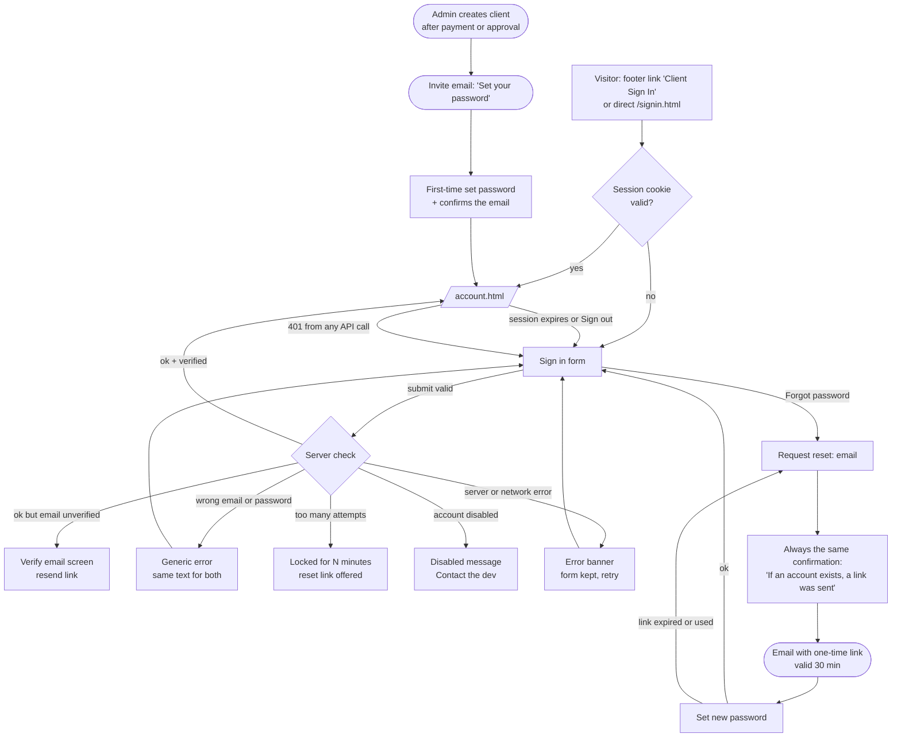

# Client portal wireframes: sign-in flow and account page

**Status:** Draft for review. Low-fidelity wireframes only; nothing here is built.
**Implements:** `docs/mvp-outline.md` -> "Client Portal MVP", "Authentication requirements", "Admin Panel MVP", "Client Journey and Portal UX", "Data Boundary", "Delivery Phases / Phase 3".
**Visual language:** the existing site theme: macOS-style `.ds-window` panels, `$` code titles with the typed dots, shared `ds-field` / `ds-input` / `ds-btn` / `ds-callout` styles and the dark glass tokens. No new components are invented; the one new piece is the status chip (section 5c).
**Last reviewed:** 2026-10-06

## How to read this

- `[ Button ]` = `.ds-btn` (primary where marked). `*` = required field. `{name}`, `{date}` mark values that come from the account record.
- **Nothing is shown as placeholder data in a real build.** If a value is missing the UI shows the honest empty state, never made-up content (fail closed, per `agent.md`).
- Wireframes show the desktop layout (about 52 columns); mobile versions are shown where the layout actually changes.

## Rules the spec already sets (these drive the design)

| Rule (source: MVP outline) | Consequence for the UI |
| --- | --- |
| Accounts are created **after confirmed payment or manual admin approval**; no self-signup. | The sign-in page has **no "Create account"**. It says how accounts are created and offers "Contact the dev". |
| Email + password login; Google login deferred. | Two fields only. No "Continue with Google". |
| Password reset, email verification, rate limiting, login-attempt protection, CSRF, HTTP-only session cookies, Argon2id/bcrypt. | Reset and verify screens exist; error copy never reveals whether an email exists; a locked state exists. |
| Portal is "a status and billing surface, not a project-management app". | No tasks, chat, files, timelines or notes on the account page. |
| Store only the Data Boundary fields. No card data, no files. | The page shows only: name, email, phone, business/project name, project metadata, status, live URL, meeting URL, invoice and payment references, subscription state. |
| Gray status = "internal use". | Gray (not started / awaiting client info) is **not shown to clients** (decision D4). |
| Admin can disable client access. | A "disabled account" sign-in state exists. |

---

## 1. Flow map



**Entry points:** footer "Client Sign In" (exists today), the sign-in page, and links in emails (invite, reset, verify). **Gated page:** `account.html` only.
**Redirect rules:** signed out on `account.html` -> `signin.html?next=account.html`; signed in on `signin.html` -> `account.html`. `next` accepts only a same-origin path from an allow-list (no open redirects).

---

## 2. Sign in

Page: `signin.html` (replaces today's placeholder). Window title `doxxus@portal — ~/sign-in`. The title uses the code style: `$ Sign in ...|`.

### 2a. Default, desktop

```text
┌──────────────────────────────────────────────────────┐
│ ●  ●  ●  doxxus@portal — ~/sign-in       client area │
├──────────────────────────────────────────────────────┤
│ CLIENT PORTAL                                        │
│ $ Sign in ...|                                       │
│ Project status and billing for active clients.       │
│                                                      │
│ Email *                                              │
│ ┌──────────────────────────────────────────────────┐ │
│ │ you@example.com                                  │ │
│ └──────────────────────────────────────────────────┘ │
│                                                      │
│ Password *                                      Show │
│ ┌──────────────────────────────────────────────────┐ │
│ │ ••••••••••                                       │ │
│ └──────────────────────────────────────────────────┘ │
│                                     Forgot password? │
│                                                      │
│                                          [ Sign in ] │
│ ──────────────────────────────────────────────────── │
│ No account yet? Accounts are created when a project  │
│ starts.                                              │
│                                  [ Contact the dev ] │
└──────────────────────────────────────────────────────┘
```

**Notes**

- Autocomplete: email `username`, password `current-password`, so password managers work. Enter submits. "Show" toggles the field type and announces its state.
- "Sign in" is disabled while a request is in flight (the same guard the contact form uses). Focus lands on the Email field on load.
- "Contact the dev" opens the existing contact modal in place, preselecting type "Other".
- No "remember me" in the MVP: one session length (decision D6).

### 2b. Mobile

Same window at full width minus 1rem; labels above fields; Sign in goes full width.

```text
┌──────────────────────────────────┐
│ ●  ●  ●  ~/sign-in               │
├──────────────────────────────────┤
│ CLIENT PORTAL                    │
│ $ Sign in ...|                   │
│ Project status and billing.      │
│                                  │
│ Email *                          │
│ ┌──────────────────────────────┐ │
│ │ you@example.com              │ │
│ └──────────────────────────────┘ │
│ Password *                  Show │
│ ┌──────────────────────────────┐ │
│ │ ••••••••••                   │ │
│ └──────────────────────────────┘ │
│                 Forgot password? │
│                                  │
│ [ Sign in ]  (full width)        │
│ ──────────────────────────────── │
│ No account yet? Accounts are     │
│ created when a project starts.   │
│ [ Contact the dev ]              │
└──────────────────────────────────┘
```

### 2c. Sign-in states

Each message sits above the form in a `.ds-callout`. **Wording never says which of email or password was wrong, and never confirms that an email exists.**

**Wrong email or password**

```text
┌──────────────────────────────────────────────────────┐
│ ▌ ⚠ That email and password do not match.            │
│ ▌   Check them and try again.                        │
└──────────────────────────────────────────────────────┘
```

**Too many attempts (rate limit)**

```text
┌──────────────────────────────────────────────────────┐
│ ▌ ⚠ Too many sign-in attempts.                       │
│ ▌   Try again in 15 minutes, or reset your password. │
└──────────────────────────────────────────────────────┘
```

**Email not verified yet**

```text
┌──────────────────────────────────────────────────────┐
│ ▌ ℹ Please verify your email first. We sent a link   │
│ ▌   to {email}.   [ Resend link ]                    │
└──────────────────────────────────────────────────────┘
```

**Account disabled by admin**

```text
┌──────────────────────────────────────────────────────┐
│ ▌ ⚠ This account is not active.                      │
│ ▌   Contact the dev if you think this is a mistake.  │
└──────────────────────────────────────────────────────┘
```

**Network or server error**

```text
┌──────────────────────────────────────────────────────┐
│ ▌ ⚠ Could not reach the server. Nothing was sent.    │
│ ▌   Your details are still here. Try again.          │
└──────────────────────────────────────────────────────┘
```

**Session expired (redirected back)**

```text
┌──────────────────────────────────────────────────────┐
│ ▌ ℹ You were signed out for security. Sign in again  │
│ ▌   to continue.                                     │
└──────────────────────────────────────────────────────┘
```

Rules: wrong-credentials and unknown-email return the **same** response with the same timing. The lockout counter is per account **and** per IP. The form is never cleared on error except the password field.

---

## 3. Forgot and reset password

Same page, state driven by the URL (`signin.html?view=forgot`, `signin.html?view=reset`) so the client-side router and the back button work.

### 3a. Request a link

```text
┌──────────────────────────────────────────────────────┐
│ ●  ●  ●  doxxus@portal — ~/reset                     │
├──────────────────────────────────────────────────────┤
│ CLIENT PORTAL                                        │
│ $ Reset password ...|                                │
│ Enter the email on your account. We'll send a        │
│ one-time link that works for 30 minutes.             │
│                                                      │
│ Email *                                              │
│ ┌──────────────────────────────────────────────────┐ │
│ │ you@example.com                                  │ │
│ └──────────────────────────────────────────────────┘ │
│                                                      │
│                                  [ Send reset link ] │
│                                                      │
│ < Back to sign in                                    │
└──────────────────────────────────────────────────────┘
```

### 3b. Confirmation (always the same, whether or not the account exists)

```text
┌──────────────────────────────────────────────────────┐
│ ●  ●  ●  doxxus@portal — ~/reset                     │
├──────────────────────────────────────────────────────┤
│ CLIENT PORTAL                                        │
│ $ Check your email ...|                              │
│                                                      │
│ ▌ ℹ If an account exists for that email, a reset     │
│ ▌   link is on its way. It expires in 30 minutes.    │
│                                                      │
│ Nothing arrived? Check spam, then try again.         │
│ [ Send again ]   < Back to sign in                   │
└──────────────────────────────────────────────────────┘
```

### 3c. Set a new password (from the email link)

```text
┌──────────────────────────────────────────────────────┐
│ ●  ●  ●  doxxus@portal — ~/reset                     │
├──────────────────────────────────────────────────────┤
│ CLIENT PORTAL                                        │
│ $ New password ...|                                  │
│ Choose a password you do not use anywhere else.      │
│                                                      │
│ New password *                                  Show │
│ ┌──────────────────────────────────────────────────┐ │
│ │ ••••••••••••                                     │ │
│ └──────────────────────────────────────────────────┘ │
│ Strength ▮▮▮▮▯   min 12 characters                   │
│                                                      │
│ Confirm password *                                   │
│ ┌──────────────────────────────────────────────────┐ │
│ │ ••••••••••••                                     │ │
│ └──────────────────────────────────────────────────┘ │
│                                                      │
│                                    [ Save password ] │
└──────────────────────────────────────────────────────┘
```

**States:** link expired or already used -> callout "This link has expired. Request a new one." with `[ Request a new link ]`. Success -> back to sign in with the note "Password updated. Sign in with your new password." All other sessions for that account end on reset.

---

## 4. First visit: invite and email verification

Triggered when an admin creates a client (after confirmed payment or approval). The invite email says only "Set your password" and links to this screen. Setting a password also confirms the email address, so a separate verify step is only needed for later email changes.

```text
┌──────────────────────────────────────────────────────┐
│ ●  ●  ●  doxxus@portal — ~/welcome       first visit │
├──────────────────────────────────────────────────────┤
│ CLIENT PORTAL                                        │
│ $ Welcome ...|                                       │
│ Your account for {business or project name} is       │
│ ready. Set a password to continue.                   │
│                                                      │
│ Signing in as   {email}   (verified by this link)    │
│                                                      │
│ Password *                                      Show │
│ ┌──────────────────────────────────────────────────┐ │
│ │ ••••••••••••                                     │ │
│ └──────────────────────────────────────────────────┘ │
│ Confirm password *                                   │
│ ┌──────────────────────────────────────────────────┐ │
│ │ ••••••••••••                                     │ │
│ └──────────────────────────────────────────────────┘ │
│                                                      │
│                                  [ Create password ] │
└──────────────────────────────────────────────────────┘
```

Expired invite -> "This invite has expired." with `[ Contact the dev ]`. An admin re-sends it; a self-serve re-invite is not offered because there is no self-signup.

---

## 5. Account page (profile)

Page: `account.html`, signed-in only. Title `$ Welcome, {name} ...|`. One page, **four stacked windows** (the same pattern as Build and Terms): each has the traffic lights and collapses. Profile and Projects start open; Billing and Security start collapsed. Anchors: `#profile`, `#projects`, `#billing`, `#security`.

### 5a. Desktop overview

```text
CLIENT PORTAL
$ Welcome, {name} ...|
Status and billing for your projects.          [ Schedule a call ] [ Contact ]
```

**Profile** (read-only in the MVP, decision D1)

```text
┌──────────────────────────────────────────────────────┐
│ ●  ●  ●  doxxus@portal — ~/profile      your details │
├──────────────────────────────────────────────────────┤
│ Name                                          {name} │
│ Email                            {email}  ✓ verified │
│ Phone                                        {phone} │
│ Business / project                   {business name} │
│                                                      │
│ ──────────────────────────────────────────────────── │
│ To change any of this:          [ Request a change ] │
└──────────────────────────────────────────────────────┘
```

**Projects**

```text
┌──────────────────────────────────────────────────────┐
│ ●  ●  ●  doxxus@portal — ~/projects       2 projects │
├──────────────────────────────────────────────────────┤
│ Legend: ● Live  ◐ In progress  ✕ Issue               │
│                                                      │
│ ┌───────────────────────┐  ┌───────────────────────┐ │
│ │ ● Live                │  │ ◐ In progress         │ │
│ │ {project name}        │  │ {project name}        │ │
│ │ {short description}   │  │ {short description}   │ │
│ │ {live url} ↗          │  │ (no live url yet)     │ │
│ │ Updated {date}        │  │ Updated {date}        │ │
│ └───────────────────────┘  └───────────────────────┘ │
│                                                      │
│ Gray (not started) is internal and hidden.           │
└──────────────────────────────────────────────────────┘
```

**Billing**

```text
┌──────────────────────────────────────────────────────┐
│ ●  ●  ●  doxxus@portal — ~/billing          payments │
├──────────────────────────────────────────────────────┤
│ Subscription   {state: active | past due | none}     │
│                                                      │
│ Date          Reference        Status    Receipt     │
│ ──────────────────────────────────────────────────── │
│ {date}        {invoice ref}    Paid      [ View ] ↗  │
│ {date}        {invoice ref}    Paid      [ View ] ↗  │
│ {date}        {payment ref}    Pending   —           │
│                                                      │
│ Receipts open the provider-hosted page (no amounts   │
│ or card data are stored here, decision D2).          │
└──────────────────────────────────────────────────────┘
```

**Security**

```text
┌──────────────────────────────────────────────────────┐
│ ●  ●  ●  doxxus@portal — ~/security                  │
├──────────────────────────────────────────────────────┤
│ Password          Last changed {date}                │
│                                  [ Change password ] │
│                                                      │
│ This device                                          │
│                                         [ Sign out ] │
│                                                      │
│ Signing out ends this session only.                  │
└──────────────────────────────────────────────────────┘
```

### 5b. Header actions

- **Schedule a call:** opens the meeting or scheduling URL the admin set for the client. If none is set the button is disabled with the hint "No call scheduled yet. Contact the dev."
- **Contact:** a small panel (not a navigation) with the contact email as an action, plus **business hours and business phone**. Those two values are not in the repo yet and must come from the owner (open item O1). Until then the panel shows the email only. No invented numbers.

```text
┌────────────────────────────────────────────────┐
│ Contact the dev                                │
│                                                │
│ Email   dev@doxxus.us      [ Open email ]      │
│ Phone   {business phone}   (to be supplied)    │
│ Hours   {business hours}   (to be supplied)    │
└────────────────────────────────────────────────┘
```

### 5c. Status chip (the only new component)

| Status | Chip | Colour token | Shown to client |
| --- | --- | --- | --- |
| Live | `● Live` | `--ds-success-fg` | yes |
| In progress / updating | `◐ In progress` | `--ds-attention-fg` | yes |
| Issue / unavailable | `✕ Issue` | `--red` from the shared palette | yes |
| Not started / awaiting client info | gray | `--ds-fg-subtle` | **no** (internal, D4) |

The chip is a `.ds-label` with a leading symbol, so it never relies on colour alone (accessibility).

### 5d. Empty, loading and error states

| State | What the user sees |
| --- | --- |
| Loading | The router's skeleton shimmer for the whole page, then the windows fill in. No flash of signed-out content: protected data is fetched, never in the HTML. |
| No projects yet | In the Projects window: "No active projects yet. Your project will appear here once work starts." + `[ Contact the dev ]`. |
| No invoices yet | "No payments recorded yet." |
| Partial failure | Only the affected window shows "Could not load projects. [ Try again ]"; the rest stays usable. |
| 401 from any call | Redirect to `signin.html?next=account.html` with the "session expired" note. |
| Account disabled mid-session | Same redirect, with the "account is not active" message. |

### 5e. Mobile account page

Windows stack in this order and stay collapsible; the header actions become two stacked buttons; the billing table becomes a list (reference and status on one line, date below).

```text
CLIENT PORTAL
$ Welcome, {name} ...|
[ Schedule a call ]
[ Contact ]

┌──────────────────────────────────┐
│ ●  ●  ●  ~/profile               │
├──────────────────────────────────┤
│ Name    {name}                   │
│ Email   {email} ✓                │
│ Phone   {phone}                  │
│ Biz     {business}               │
│ [ Request a change ]             │
└──────────────────────────────────┘
┌──────────────────────────────────┐
│ ●  ●  ●  ~/projects            2 │
├──────────────────────────────────┤
│ ● Live  {project name}           │
│   {short description}            │
│   {live url} ↗                   │
│ ◐ In progress  {project}         │
│   {short description}            │
└──────────────────────────────────┘
┌──────────────────────────────────┐
│ ●  ●  ●  ~/billing             ▸ │
├──────────────────────────────────┤
│ (collapsed)                      │
└──────────────────────────────────┘
┌──────────────────────────────────┐
│ ●  ●  ●  ~/security            ▸ │
├──────────────────────────────────┤
│ (collapsed)                      │
└──────────────────────────────────┘
```

---

## 6. Where it lives in the site

- **Footer:** "Client Sign In" already exists. After sign-in it reads "Account".
- **Navbar:** decision D5. Default: **no new navbar item**, so the order stays Home, Projects, About, Build, Contact. The footer link is the entry.
- **Page chrome:** both pages use the shared shell (particles, footer, contact modal, router with skeleton). They set `data-page` so the navbar indicator clears (neither has a navbar item).
- **Client-side router:** both routes work with the persistent navbar. The router must treat a 401 as "navigate to sign-in" without a full reload, and never cache `account.html` data.

---

## 7. What the backend must provide (sketch, for later)

Aligned to the Node API foundation in `server/` (today it only serves `GET /health`). Hosted separately from the static site, per the outline.

| Method and path | Purpose | Notes |
| --- | --- | --- |
| `POST /auth/login` | Create a session | Rate limited per account and IP; constant-time compare; same error for wrong email or password |
| `POST /auth/logout` | End this session | Clears the cookie |
| `POST /auth/forgot` | Request a reset email | Always returns the same response |
| `POST /auth/reset` | Set a new password with a one-time token | Single use, 30-minute expiry; ends other sessions |
| `POST /auth/accept-invite` | First-time password from the invite | Marks the email verified |
| `POST /auth/resend-verification` | Resend the verify link | Rate limited |
| `GET /me` | Profile (name, email, phone, business, verified) | 401 if no session |
| `GET /me/projects` | Project cards | Excludes internal-only statuses |
| `GET /me/billing` | Invoice and payment references, subscription state | References and status only |

**Session and cookie model:** an HTTP-only, `Secure`, `SameSite=Lax` cookie. Serving the API from `api.doxxus.us` keeps it **same-site** with `doxxus.us`, so Lax cookies work with CORS (`credentials: include`, allow-origin `https://doxxus.us`). State-changing calls carry a CSRF token header. Passwords hashed with Argon2id (or bcrypt). JavaScript never sees the cookie, so the page learns who is signed in only from `GET /me`.

**Accessibility and security checklist for the build**

- Real `<label>`s, `aria-live` regions for errors, focus moves to the first error, visible focus rings, reduced motion respected (the typed title and the skeleton already do this).
- Autocomplete `username`, `current-password`, `new-password`. Paste is allowed in password fields.
- No credentials or tokens in URLs except the single-use reset or invite token, which is removed from the address bar after load (`history.replaceState`) and used once.
- Error copy is identical for an unknown email and a wrong password, and timing is equalised.
- No analytics or third-party scripts on the two portal pages.

---

## 8. Decisions to confirm

| # | Decision | Default in these wireframes |
| --- | --- | --- |
| D1 | Can clients edit their own profile? | **Read-only** with "Request a change" (opens the contact modal). Editing phone or business name is a small later addition. |
| D2 | Show payment amounts? | **No.** The Data Boundary lists references and status, not amounts. Receipts link to the provider-hosted page. Storing amounts would change the boundary. |
| D3 | Manage the subscription in the portal? | **Display state only** in the MVP; "Manage" could later link to the provider's customer portal. |
| D4 | Show gray (internal) projects to clients? | **Hidden**, matching the outline's "internal use". |
| D5 | Navbar entry for the portal? | **Footer only**, no new navbar item. |
| D6 | Session length and "remember me" | One fixed length (suggest 12 hours idle, 7 days absolute); no remember-me. |
| D7 | Password rules | Minimum 12 characters, no composition rules, breached-password check if feasible. |

Journey-level decisions **J1-J6** and open items **O4-O6** (account creation, when an account exists, status emails, the IT-support gate, the interim manual path, prep checklist storage, interim payment method, admin sign-in) are defined in `docs/mvp-outline.md` -> "Client Journey and Portal UX" -> "Decisions for the journey".

**Open items (need input, not guesses):** O1 business phone and hours for the Contact panel; O2 the scheduling mechanism (a Meet link per client vs a booking page); O3 sender address and wording for the invite, reset and verify emails.

---

## 9. Out of scope here (deliberately)

A full admin wireframe set (the admin has an inventory and three core screens in section 12). Also out: Google login, two-factor authentication, file uploads, chat or tickets, project timelines, card forms, and multiple users per client.

## 10. Build order (maps to Phase 3)

1. Sign-in page with the real form, states and router handling. With no API yet the form stays disabled with an honest "not open yet" message.
2. API: `/auth/login`, `/me`, session cookie, rate limiting, hashing.
3. Account page: Profile and Projects (read-only, from `/me` and `/me/projects`).
4. Forgot/reset, invite and verification emails and screens.
5. Billing window once payment references exist (needs the Phase 2 Stripe webhooks to record real data).
6. Security window (change password), status chip polish, empty and error states.

---

## 11. Utility screens (client)

These are the actions behind the account page (see `docs/mvp-outline.md` -> "Client Journey and Portal UX" -> "Client utilities"). They reuse the existing contact modal wherever a message is the right tool, so no new messaging system is built.

### 11a. Schedule a call

```text
Enabled     [ Schedule a call ]   opens {meeting url} in a new tab
Disabled    [ Schedule a call ]   dimmed; hint: "No call scheduled yet.
                                  Contact the dev."
```

The meeting URL is set per client by the admin (project editor, section 12c). The button never builds a link itself.

### 11b. Request a change (profile)

The contact modal opens with the type preselected and the note prefilled. **When signed in, Name, Email and Phone are prefilled from the profile (still editable)**, so the request is two clicks.
```text
┌──────────────────────────────────────────────────────┐
│ ●  ●  ●  doxxus@contact — ~/message      new message │
├──────────────────────────────────────────────────────┤
│ you found me.                                        │
│ $ Leave a message ...|                               │
│                                                      │
│ Type                                                 │
│ ┌──────────────────────────────────────────────────┐ │
│ │ Other (please specify)                           │ │
│ └──────────────────────────────────────────────────┘ │
│ Name                                                 │
│ ┌──────────────────────────────────────────────────┐ │
│ │ {name}                                           │ │
│ └──────────────────────────────────────────────────┘ │
│ Email                                                │
│ ┌──────────────────────────────────────────────────┐ │
│ │ {email}                                          │ │
│ └──────────────────────────────────────────────────┘ │
│ Phone                                                │
│ ┌──────────────────────────────────────────────────┐ │
│ │ {phone}                                          │ │
│ └──────────────────────────────────────────────────┘ │
│ Note                                                 │
│ ┌──────────────────────────────────────────────────┐ │
│ │ I would like to change my profile:               │ │
│ └──────────────────────────────────────────────────┘ │
│                                                      │
│                                             [ Send ] │
└──────────────────────────────────────────────────────┘
```
### 11c. Report an issue (from a project card)

Same modal; only the note differs, and the project name comes from the card the client clicked.
```text
┌──────────────────────────────────────────────────────┐
│ ●  ●  ●  doxxus@contact — ~/message      new message │
├──────────────────────────────────────────────────────┤
│ Type: Other   (name, email, phone prefilled)         │
│                                                      │
│ Note                                                 │
│ ┌──────────────────────────────────────────────────┐ │
│ │ Issue with {project name}:                       │ │
│ └──────────────────────────────────────────────────┘ │
│                                                      │
│                                             [ Send ] │
└──────────────────────────────────────────────────────┘
```
### 11d. Receipt

A billing row's "View" opens the provider-hosted receipt in a new tab. Nothing is stored here beyond the reference and status.

```text
{date}        {invoice ref}    Paid      [ View ] ↗     -> provider receipt (new tab)
```

### 11e. IT support entry (eligible clients only, decision J4)

Shown only when the client record carries the IT-support flag. Not shown to anyone else, so the outline's client-only rule is enforced by the page.
```text
┌──────────────────────────────────────────────────────┐
│ ●  ●  ●  doxxus@portal — ~/it-support   clients only │
├──────────────────────────────────────────────────────┤
│ Need a machine looked at? Request a diagnostic.      │
│ Every IT job is quoted individually.                 │
│                                                      │
│                               [ Request IT support ] │
└──────────────────────────────────────────────────────┘
```
The button opens the contact modal with type "IT support" and the note prefilled.

---

## 12. Admin screens (low fidelity)

Private and operational, not a CRM. Same window theme as the client side. This is the inventory and three core screens; a full set follows once the client page ships. Fields shown are inside the Data Boundary except the IT-support flag and the Activity list, which are additions pending approval (open item O6 in the outline).

### 12a. Clients list
```text
┌────────────────────────────────────────────────────────────────────────┐
│ ●  ●  ●  doxxus@admin — ~/clients                            3 clients │
├────────────────────────────────────────────────────────────────────────┤
│ CLIENTS                                                 [ New client ] │
│                                                                        │
│ Search                                                                 │
│ ┌────────────────────────────────┐                                     │
│ │ name, email or business        │                                     │
│ └────────────────────────────────┘                                     │
│ Access: ( ) All   ( ) Active   ( ) Invited   ( ) Disabled              │
│                                                                        │
│ Name             Business / project       Access     Projects  Updated │
│ ────────────────────────────────────────────────────────────────────── │
│ {name}           {business}               Active     2         {date}  │
│ {name}           {business}               Invited    1         {date}  │
│ {name}           {business}               Disabled   1         {date}  │
└────────────────────────────────────────────────────────────────────────┘
```
### 12b. Client detail

One page, stacked windows (the same collapsible pattern as the client page): Profile, Projects, Billing, Access.
```text
┌────────────────────────────────────────────────────────────────────────┐
│ ●  ●  ●  doxxus@admin — ~/clients/{id}/profile                         │
├────────────────────────────────────────────────────────────────────────┤
│ Name               {name}                          [ Edit ]            │
│ Email              {email}                                             │
│ Phone              {phone}                                             │
│ Business / project  {business name}                                    │
└────────────────────────────────────────────────────────────────────────┘
```
```text
┌────────────────────────────────────────────────────────────────────────┐
│ ●  ●  ●  doxxus@admin — ~/clients/{id}/projects                      2 │
├────────────────────────────────────────────────────────────────────────┤
│ Projects                                               [ Add project ] │
│ ────────────────────────────────────────────────────────────────────── │
│ ● Live          {project name}      updated {date}   [ Edit ]          │
│ ◐ In progress   {project name}      updated {date}   [ Edit ]          │
└────────────────────────────────────────────────────────────────────────┘
```
```text
┌────────────────────────────────────────────────────────────────────────┐
│ ●  ●  ●  doxxus@admin — ~/clients/{id}/billing                         │
├────────────────────────────────────────────────────────────────────────┤
│ Subscription  {state}   (set by Stripe webhook, read only)             │
│                                                                        │
│ Date        Reference        Status    Source                          │
│ ────────────────────────────────────────────────────────────────────── │
│ {date}      {invoice ref}    Paid      webhook                         │
│ {date}      {payment ref}    Pending   manual entry                    │
│                                                                        │
│                                                      [ Add reference ] │
└────────────────────────────────────────────────────────────────────────┘
```
```text
┌────────────────────────────────────────────────────────────────────────┐
│ ●  ●  ●  doxxus@admin — ~/clients/{id}/access                          │
├────────────────────────────────────────────────────────────────────────┤
│ Access  Active                       IT support  [x] eligible          │
│                                                                        │
│ [ Resend invite ]   [ Disable access ]                                 │
│                                                                        │
│ Invite sent {date}. Last sign-in {date}.                               │
└────────────────────────────────────────────────────────────────────────┘
```
### 12c. Project editor

What the admin sets here is exactly what the client sees. The preview shows the client-side chip.
```text
┌────────────────────────────────────────────────┐
│ ●  ●  ●  doxxus@admin — ~/projects/{id}   edit │
├────────────────────────────────────────────────┤
│ Project name *                                 │
│ ┌──────────────────────────────────────┐       │
│ │ {project name}                       │       │
│ └──────────────────────────────────────┘       │
│                                                │
│ Short description                              │
│ ┌──────────────────────────────────────┐       │
│ │ {short description}                  │       │
│ └──────────────────────────────────────┘       │
│                                                │
│ Status                                         │
│ ( ) Not started (internal only)                │
│ ( ) In progress                                │
│ (•) Live                                       │
│ ( ) Issue                                      │
│                                                │
│ Live URL                                       │
│ ┌──────────────────────────────────────┐       │
│ │ https://                             │       │
│ └──────────────────────────────────────┘       │
│                                                │
│ Meeting URL (Schedule a call)                  │
│ ┌──────────────────────────────────────┐       │
│ │ https://                             │       │
│ └──────────────────────────────────────┘       │
│                                                │
│ Client sees:  ● Live                           │
│                                                │
│                     [ Cancel ]  [ Save ]       │
└────────────────────────────────────────────────┘
```
### 12d. Invite and access states

```text
Invite sent
▌ ✓ Invite sent to {email}. Status: Invited. It expires in {n} days.
▌   [ Resend invite ]

Disable access (confirmation)
┌────────────────────────────────────────────────┐
│ Disable access for {name}?                     │
│ Their sessions end immediately. They will see  │
│ "This account is not active" at next sign-in.  │
│                         [ Cancel ]  [ Disable ]│
└────────────────────────────────────────────────┘
```

Every create, edit, invite, resend and disable writes a line to the Activity list (actor, action, target, timestamp).

### 12e. Admin screen inventory

| Screen | Purpose | Notes |
| --- | --- | --- |
| Clients list | Find a client | Search and access filter |
| Client detail | One page per client | Profile, Projects, Billing, Access windows |
| Project editor | Set status, URLs | Status is the only way a client sees progress |
| Consultations | Bookings and email state | Resend prep document and meeting link |
| Activity | Audit trail | Read-only |
